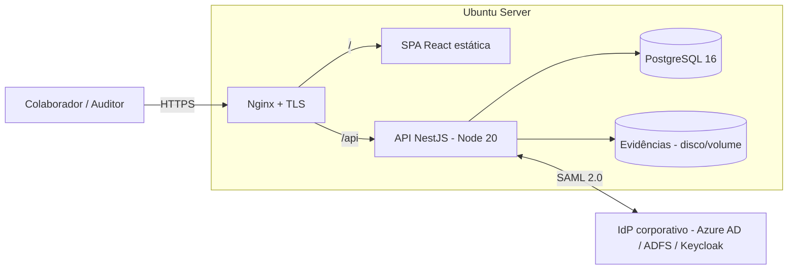
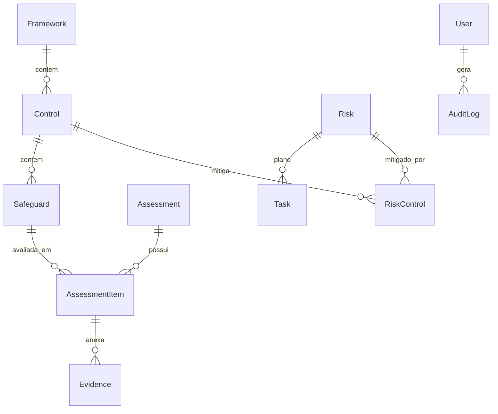

# Arquitetura técnica — Sentinela CIS

## Visão geral

Aplicação web de três camadas, empacotada em contêineres e publicada atrás de um Nginx com TLS.

## Componentes

### Frontend — React + Vite + TypeScript
- SPA servida como arquivos estáticos pelo Nginx.
- Reaproveita o design da demo (tokens CSS, gauge de maturidade, espectro).
- Fala com a API em `/api` via `fetch` com cookies de sessão (`credentials: include`).
- Telas: **Dashboard**, **Auditoria** (18 controles / 153 salvaguardas), **Riscos**.

### Backend — NestJS (Node 20) + TypeScript
Módulos:
- `auth` — SSO SAML 2.0, sessão, guarda de rotas, RBAC.
- `controls` — catálogo CIS (controles, salvaguardas, perguntas, exemplos).
- `assessments` — avaliação de maturidade por salvaguarda + evidências.
- `risks` — registro de riscos (inerente/residual), tarefas, vínculo a controles.
- `health` — readiness/liveness.
- `audit` (interceptor) — trilha de auditoria de escritas.

### Banco — PostgreSQL 16 + Prisma
Modelo relacional (ver `backend/prisma/schema.prisma`):

- **Maturidade** é calculada com salvaguardas **não avaliadas contando como 0**; apenas as marcadas **N/A** ficam fora do denominador (mesma regra da demo).

## Autenticação (SAML 2.0)
- A aplicação é o **Service Provider (SP)**; o **IdP** é o SSO corporativo.
- Fluxo: usuário sem sessão → `/api/auth/login` → redireciona ao IdP → IdP autentica → `POST /api/auth/saml/callback` (ACS) → valida a asserção → cria/atualiza `User` → grava sessão em cookie `HttpOnly`+`Secure`.
- Detalhes e cadastro no IdP em [`SAML.md`](SAML.md).

## Segurança
- Cookies de sessão `HttpOnly`, `Secure`, `SameSite=Lax`; segredo forte em `SESSION_SECRET`.
- TLS obrigatório (Nginx + certbot); HSTS.
- RBAC por papel (`ADMIN`, `AUDITOR`, `LEITOR`).
- Trilha de auditoria (`AuditLog`) para toda alteração de avaliação/risco.
- Evidências em volume dedicado (evoluível para S3/MinIO).

## Escala e evolução
- Stateless na API (sessão pode migrar para Redis) → múltiplas réplicas atrás do Nginx.
- Backups do Postgres (`pg_dump`) e do volume de evidências.
- Próximos módulos (já mapeados na demo anterior): controles internos recorrentes, políticas, exceções, incidentes, parceiros.
